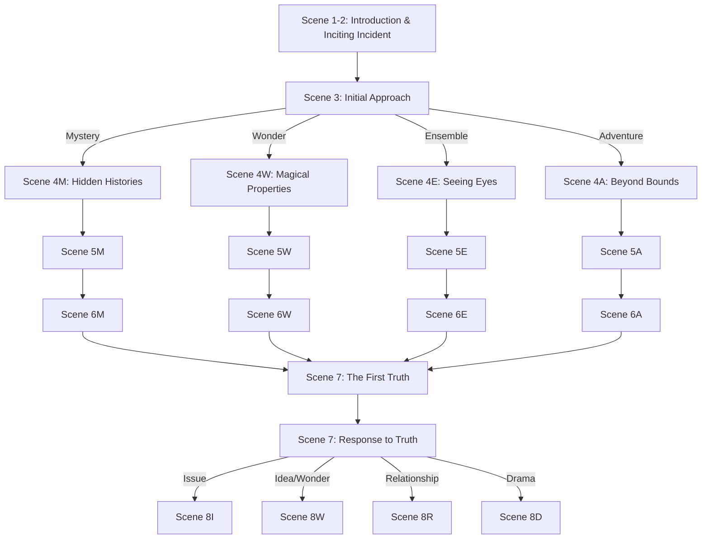

# Branches

## Main Branch Map
- **Initial Choice (Scene 3):** Mystery, Wonder/Idea, Ensemble, Adventure tracks
- **Mid-Game Convergence (Scene 7):** All tracks converge at the revelation of magic's true history.
- **Second Major Choice (Scene 7):** Issue, Idea/Wonder, Relationship/Thriller, Drama tracks
- [Visual representation to be created later]

## Elemental Genre Implementation

### Mystery Track (Scenes 4M-6M)
- **Core Emotion:** Curiosity
- **Scene 4M Turn:** From seeking information (neutral) to discovering suppressed knowledge (positive)
- **Scene 5M Turn:** From having evidence (positive) to facing contradiction/danger (negative)
- **Scene 6M Turn:** From confusion (negative) to breakthrough understanding (positive)
- **Key Elements:** 
  - Hypothesis formation and testing
  - Red herrings and false leads
  - Progressive revelations
  - "Detective's gambit" moments

### Wonder/Idea Track (Scenes 4W-6W)
- **Core Emotion:** Awe/Intellectual Fascination
- **Scene 4W Turn:** From theoretical understanding (neutral) to practical insight (positive)
- **Scene 5W Turn:** From initial success (positive) to unexpected complication (negative)
- **Scene 6W Turn:** From failure (negative) to breakthrough discovery (positive)
- **Key Elements:**
  - Dramatic breakthrough moments
  - Direct experiences of ancient magic
  - Contrast between magical systems
  - "Eureka" revelations

### Ensemble Track (Scenes 4E-6E)
- **Core Emotion:** Belonging/Collective Achievement
- **Scene 4E Turn:** From individual investigation (neutral) to potential alliance (positive)
- **Scene 5E Turn:** From team formation (positive) to internal conflict (negative)
- **Scene 6E Turn:** From discord (negative) to unified purpose (positive)
- **Key Elements:**
  - Solo failure moments
  - Complementary skill demonstrations
  - Trust-building challenges
  - Collective achievement moments

### Adventure Track (Scenes 4A-6A)
- **Core Emotion:** Excitement/Danger
- **Scene 4A Turn:** From planning (neutral) to active infiltration (negative tension)
- **Scene 5A Turn:** From initial success (positive) to discovery/pursuit (negative)
- **Scene 6A Turn:** From capture/danger (negative) to escape/discovery (positive)
- **Key Elements:**
  - Physical danger moments
  - Vivid sensory descriptions
  - Narrow escapes
  - Environmental challenges

## Scene 7: The First Truth (Convergence)
- **Core Emotion:** Revelation/Disillusionment
- **Opening Value:** Partial understanding (positive)
- **Turn:** Discovery of deliberate deception (negative)
- **Resolution:** New determination based on truth (positive but changed)
- **Key Elements:**
  - Consistent core revelation regardless of path
  - Path-specific contextual elements
  - Emotional payoff proportional to buildup
  - Clear value shift for protagonist

## Critical Decisions

### Scene 3: Initial Approach
- **Mystery: Investigate the source of the magic.**
  - Immediate consequence: Draws attention from Concordat archivists, access to historical records
  - Variables affected: `relationship_concordat` (-1), `knowledge_ancient_magic` (+1)
  - Branch path: Historical investigation, document analysis, pattern recognition
  - Socioeconomic context: Appeals to those with academic backgrounds, requires research privileges
  - Regulatory implications: Works within system initially but uncovers its limitations

- **Wonder/Idea: Understand how the magic works.**
  - Immediate consequence: Reveals unique properties of ancient magic, technical challenges
  - Variables affected: `magical_aptitude_ancient` (+1), `magical_resources` (-1)
  - Branch path: Theoretical development, experimental testing, magical innovation
  - Socioeconomic context: Requires access to magical education and resources
  - Regulatory implications: Challenges Concordat's magical framework and assumptions

- **Ensemble: Find others who perceive the patterns.**
  - Immediate consequence: Connects with diverse network of pattern-sensitives across social classes
  - Variables affected: `relationship_keepers` (+1), `access_magical_locations` (+1)
  - Branch path: Community building, trust development, collective action
  - Socioeconomic context: Crosses class boundaries, reveals different experiences of magic
  - Regulatory implications: Creates alternative power structures outside Concordat control

- **Adventure: Access restricted areas with strong magical signatures.**
  - Immediate consequence: Discovers physical evidence of ancient magic, faces security systems
  - Variables affected: `relationship_concordat` (-2), `magical_resources` (+2)
  - Branch path: Exploration, infiltration, physical challenges
  - Socioeconomic context: Requires physical access to restricted areas, often controlled by elites
  - Regulatory implications: Direct challenge to Concordat's territorial control

### Scene 4M: Hidden Histories (Mystery Track)
- **Track down descendants of pre-Awakening mages.**
  - Immediate consequence: Connects with families who maintained secret magical traditions
  - Variables affected: `relationship_keepers` (+1), `knowledge_ancient_magic` (+1)
  - Branch path: Leads to oral histories contradicting official records
  - Socioeconomic context: Reveals how old wealth families maintained magical knowledge
  - Scene turn: From uncertainty to discovery (positive shift)

- **Research city planning archives.**
  - Immediate consequence: Discovers ley line manipulation in city development
  - Variables affected: `knowledge_ancient_magic` (+1), `relationship_concordat` (-1)
  - Branch path: Reveals deliberate magical infrastructure design
  - Socioeconomic context: Shows how magical geography reinforced class divisions
  - Scene turn: From ignorance to revelation (positive shift)

- **Perform a specialized attunement ritual.**
  - Immediate consequence: Gains ability to perceive historical magical imprints
  - Variables affected: `magical_aptitude_ancient` (+2), `relationship_concordat` (-1)
  - Branch path: Begins to see the city's magical history directly
  - Socioeconomic context: Requires rare components often accessible only to privileged
  - Scene turn: From limited perception to expanded awareness (positive shift)

### Scene 4W: Magical Properties (Wonder/Idea Track)
- **Develop a theoretical model of the magic.**
  - Immediate consequence: Creates framework that explains inconsistencies in Concordat theory
  - Variables affected: `knowledge_ancient_magic` (+2), `magical_aptitude_concordat` (+1)
  - Branch path: Leads to academic challenges and theoretical breakthroughs
  - Socioeconomic context: Requires academic resources and credentials
  - Scene turn: From confusion to theoretical understanding (positive shift)

- **Create a ritual tool for access.**
  - Immediate consequence: Builds device that interacts with ancient magic systems
  - Variables affected: `magical_aptitude_ancient` (+1), `magical_resources` (-1)
  - Branch path: Leads to experimental magical engineering
  - Socioeconomic context: Requires technical resources and workshop access
  - Scene turn: From theory to practical application (positive shift)

- **Consult with magical creatures.**
  - Immediate consequence: Gains non-human perspective on magic's nature
  - Variables affected: `relationship_keepers` (+1), `knowledge_ancient_magic` (+1)
  - Branch path: Leads to understanding of magic's ecological aspects
  - Socioeconomic context: Requires access to Veil District, often restricted to specialists
  - Scene turn: From human-centric to expanded perspective (positive shift)

### Scene 4E: Seeing Eyes (Ensemble Track)
- **Pool magical resources for access.**
  - Immediate consequence: Creates shared magical tools through community contribution
  - Variables affected: `magical_resources` (+2), `relationship_threshold` (+1)
  - Branch path: Develops collective magical working methods
  - Socioeconomic context: Demonstrates how resource sharing overcomes individual limitations
  - Scene turn: From resource scarcity to collective abundance (positive shift)

- **Build a secure network of allies.**
  - Immediate consequence: Establishes trust network across different magical communities
  - Variables affected: `relationship_threshold` (+1), `relationship_keepers` (+1)
  - Branch path: Creates information-sharing system outside Concordat monitoring
  - Socioeconomic context: Connects people across class boundaries with shared purpose
  - Scene turn: From isolation to connection (positive shift)

- **Establish a team decision-making framework.**
  - Immediate consequence: Creates democratic magical working process
  - Variables affected: `relationship_threshold` (+2), `relationship_concordat` (-1)
  - Branch path: Develops alternative governance model for magical practice
  - Socioeconomic context: Challenges hierarchical Concordat authority structures
  - Scene turn: From individual authority to collective governance (positive shift)

### Scene 4A: Beyond Bounds (Adventure Track)
- **Explore abandoned ritual chambers.**
  - Immediate consequence: Discovers pre-Concordat magical workings still active
  - Variables affected: `knowledge_ancient_magic` (+2), `magical_resources` (+1)
  - Branch path: Leads to hidden network of old magical sites
  - Socioeconomic context: Located in neglected areas with less Concordat surveillance
  - Scene turn: From planning to active discovery (positive tension)

- **Explore restricted nexus points.**
  - Immediate consequence: Witnesses Concordat's control mechanisms for ley line energy
  - Variables affected: `relationship_concordat` (-2), `knowledge_ancient_magic` (+1)
  - Branch path: Reveals how magical energy is harvested and distributed unequally
  - Socioeconomic context: Shows how magical resources are directed to wealthy districts
  - Scene turn: From safety to danger (negative tension)

- **Explore the private estate of first Awakening manifestations.**
  - Immediate consequence: Discovers evidence of Awakening's engineered nature
  - Variables affected: `knowledge_ancient_magic` (+2), `relationship_concordat` (-1)
  - Branch path: Reveals connections between wealthy families and Awakening control
  - Socioeconomic context: Demonstrates how elites positioned themselves to benefit from Awakening
  - Scene turn: From ignorance to revelation (positive shift with negative implications)

### Scene 7: The First Truth
- **Expose the Concordat's manipulation (Issue).**
  - Immediate consequence: Creates public challenge to Concordat authority
  - Variables affected: `relationship_concordat` (-3), `relationship_threshold` (+2)
  - Branch path: Political conflict, system reform, potential revolution
  - Socioeconomic context: Challenges existing power structures and wealth distribution
  - Regulatory implications: Direct confrontation with regulatory system
  - Scene turn: From private knowledge to public action (negative tension)

- **Recover and spread understanding of original magic (Idea/Wonder).**
  - Immediate consequence: Begins educational movement about ancient magical approaches
  - Variables affected: `knowledge_ancient_magic` (+2), `magical_aptitude_ancient` (+1)
  - Branch path: Knowledge preservation, educational reform, magical innovation
  - Socioeconomic context: Democratizes magical knowledge previously restricted to elites
  - Regulatory implications: Creates alternative to Concordat magical framework
  - Scene turn: From theory to practical application (positive shift)

- **Protect the Keepers (Relationship/Thriller).**
  - Immediate consequence: Allies with ancient magical tradition bearers
  - Variables affected: `relationship_keepers` (+3), `relationship_concordat` (-1)
  - Branch path: Conspiracy navigation, trust building, secret preservation
  - Socioeconomic context: Connects with hidden network spanning all social classes
  - Regulatory implications: Preserves knowledge outside regulatory framework
  - Scene turn: From isolation to alliance (positive shift with tension)

- **Understand personal connection to original magic (Drama).**
  - Immediate consequence: Discovers family connection to pre-Awakening magic
  - Variables affected: `magical_aptitude_ancient` (+2), `knowledge_ancient_magic` (+1)
  - Branch path: Personal transformation, identity exploration, heritage connection
  - Socioeconomic context: Explores how magical heritage affects social position
  - Regulatory implications: Personal embodiment of alternative magical approach
  - Scene turn: From external quest to internal journey (positive shift)

## Branch-Specific Content

### Mystery Track Unique Elements
- **Unique characters:** Archival spirits, record keepers, historical witnesses
- **Unique locations:** Forgotten libraries, memory palaces, time-dilated archives
- **Unique revelations:** The systematic alteration of historical records after the Awakening
- **Socioeconomic lens:** How historical knowledge has been controlled and distributed
- **Regulatory focus:** The Concordat's information control systems

### Wonder Track Unique Elements
- **Unique characters:** Magical theorists, experimental enchanters, magical creatures
- **Unique locations:** Research laboratories, magical workshops, theoretical spaces
- **Unique revelations:** The fundamental principles of pre-Awakening magic
- **Socioeconomic lens:** How access to magical education creates privilege
- **Regulatory focus:** The limitations imposed on magical research and innovation

### Ensemble Track Unique Elements
- **Unique characters:** Community organizers, magical collectives, cross-class alliances
- **Unique locations:** Community magical centers, underground meeting spaces, shared workings
- **Unique revelations:** The power of collective magical practice outside institutions
- **Socioeconomic lens:** How communities overcome resource limitations through cooperation
- **Regulatory focus:** Alternative governance models for magical practice

### Adventure Track Unique Elements
- **Unique characters:** Magical explorers, security specialists, territorial entities
- **Unique locations:** Restricted magical zones, power generation facilities, wild magic areas
- **Unique revelations:** The physical infrastructure controlling magical energy flow
- **Socioeconomic lens:** How physical space is controlled and access restricted
- **Regulatory focus:** Territorial enforcement and resource control

## Convergence Points

### Scene 7: The First Truth
- **Incoming branches:** Mystery, Wonder, Ensemble, Adventure
- **Adaptation mechanics:** Each approach reveals different aspects of the same core truth
- **Continuity management:** Key revelation remains consistent but context varies
- **Socioeconomic implications:** All paths reveal how the Awakening reinforced existing power structures
- **Regulatory revelation:** The deliberate limitation of magic to make it controllable

### Scene 10: The Thinning Veil
- **Incoming branches:** Issue, Idea/Wonder, Relationship, Drama
- **Adaptation mechanics:** Different approaches to addressing the accelerating Veil thinning
- **Continuity management:** Crisis remains consistent but available solutions vary
- **Socioeconomic implications:** How different classes experience magical instability differently
- **Regulatory revelation:** The Concordat's inability to maintain control as magic evolves

## Second Branch Set (From Scene 7)

### Issue Track (Scenes 8I-9I)
- **Core Emotion:** Justice/Righteous Anger
- **Scene 8I Turn:** From revelation to action (positive tension)
- **Scene 9I Turn:** From initial resistance to growing movement (positive to negative to positive)
- **Key Elements:**
  - Systemic critique moments
  - Power confrontation scenes
  - Moral dilemmas about means vs. ends
  - Coalition building across class lines

### Idea/Wonder Track (Scenes 8W-9W)
- **Core Emotion:** Liberation/Possibility
- **Scene 8W Turn:** From theory to practice (positive shift)
- **Scene 9W Turn:** From initial success to unexpected consequences (positive to negative to positive)
- **Key Elements:**
  - Knowledge democratization
  - Experimental magic implementation
  - Traditional-modern synthesis
  - Educational transformation

### Relationship/Thriller Track (Scenes 8R-9R)
- **Core Emotion:** Trust/Suspense
- **Scene 8R Turn:** From alliance to betrayal risk (positive to negative)
- **Scene 9R Turn:** From danger to security (negative to positive)
- **Key Elements:**
  - Trust testing moments
  - Hidden agenda revelations
  - Loyalty conflicts
  - Sacrifice opportunities

### Drama Track (Scenes 8D-9D)
- **Core Emotion:** Self-Discovery/Transformation
- **Scene 8D Turn:** From external to internal focus (neutral to negative)
- **Scene 9D Turn:** From identity crisis to integration (negative to positive)
- **Key Elements:**
  - Heritage revelation moments
  - Identity questioning
  - Personal magical awakening
  - Reconciliation of past and present
